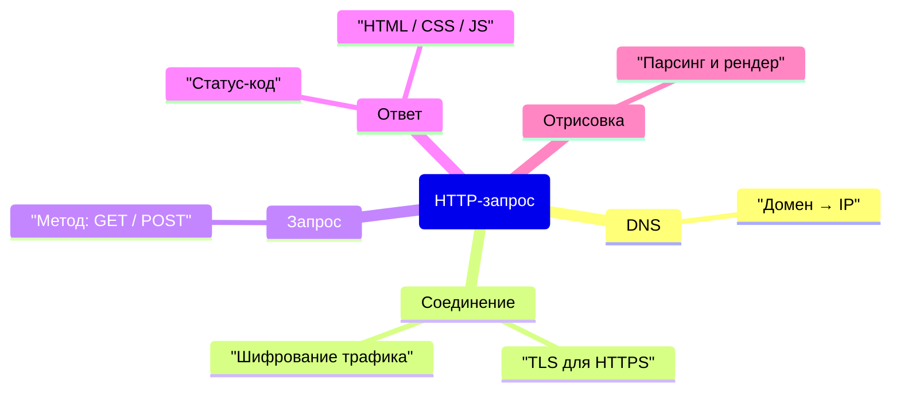
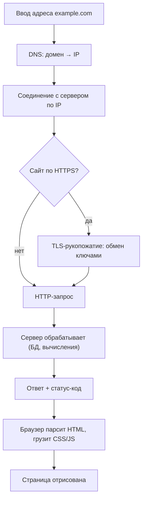
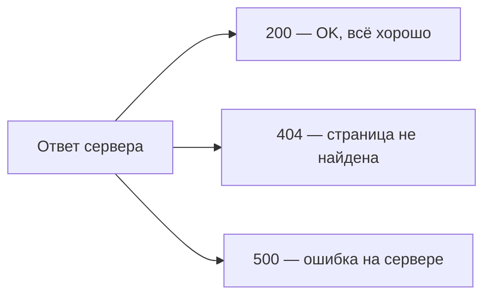

# Как работает HTTP-запрос

> **TL;DR.** HTTP — это простой протокол «вопрос-ответ»: браузер (клиент) спрашивает, сервер отвечает. Путь от ввода адреса до картинки на экране — DNS → соединение (для HTTPS ещё TLS) → HTTP-запрос → ответ со статус-кодом → отрисовка страницы — обычно занимает меньше секунды.

## 📑 Оглавление
- [Карта темы](#карта-темы)
- [1. Этапы HTTP-запроса](#1-этапы-http-запроса)
- [2. HTTP-методы](#2-http-методы)
- [3. Статус-коды](#3-статус-коды)
- [Ключевые термины](#-ключевые-термины)
- [Главные выводы](#-главные-выводы)
- [Вопросы для самопроверки](#-вопросы-для-самопроверки)

## 🗺️ Карта темы

## 1. Этапы HTTP-запроса

Полный путь от ввода адреса до готовой страницы — это последовательность шагов:

- **DNS** — «телефонная книга интернета»: по домену возвращает IP-адрес.
- **TLS-рукопожатие** нужно для HTTPS, чтобы зашифровать трафик.
  > 💬 «Иначе пароли бы летели открытым текстом» — поэтому почти все сайты сейчас на HTTPS.
- Весь цикл обычно укладывается в **меньше секунды**.

## 2. HTTP-методы

| Метод | Когда используется |
|---|---|
| `GET` | Читаем данные (открыть страницу) — самый частый |
| `POST` | Отправляем данные (форма логина) |
| `PUT` / `DELETE` | Изменение/удаление — больше для API |

## 3. Статус-коды

Три самых частых, которые стоит запомнить:

## 🔑 Ключевые термины

| Термин | Определение |
|---|---|
| **HTTP** | Протокол «вопрос-ответ» между клиентом и сервером |
| **DNS** | Сопоставляет доменное имя и IP-адрес |
| **HTTPS / TLS** | Шифрование трафика через обмен ключами |
| **Статус-код** | Число в ответе: результат обработки запроса |

## ✅ Главные выводы

- HTTP — это **просто протокол «вопрос-ответ»**, ничего магического.
- HTTPS защищает данные: без него пароли передавались бы открытым текстом.
- Статус-код сразу показывает исход: **200** — успех, **404** — не найдено, **500** — ошибка сервера.

## ❓ Вопросы для самопроверки

- Зачем браузеру обращаться к DNS перед загрузкой сайта?
- Что добавляет HTTPS по сравнению с HTTP и почему это важно?
- Чем `GET` отличается от `POST`?
- Что означают коды 200, 404 и 500?
