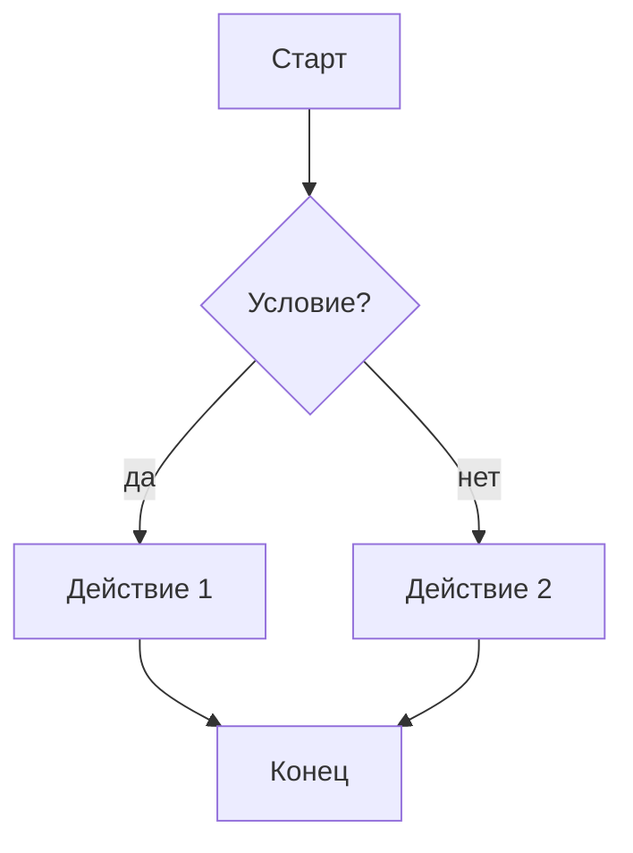
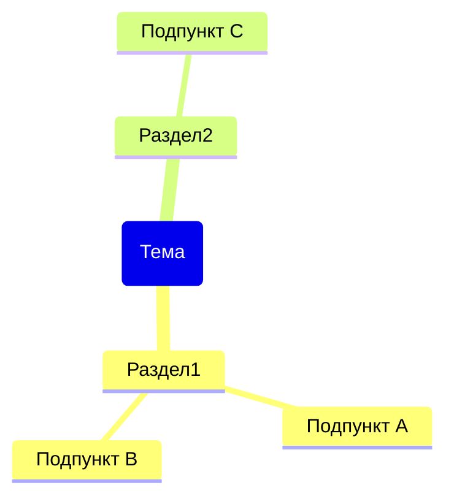
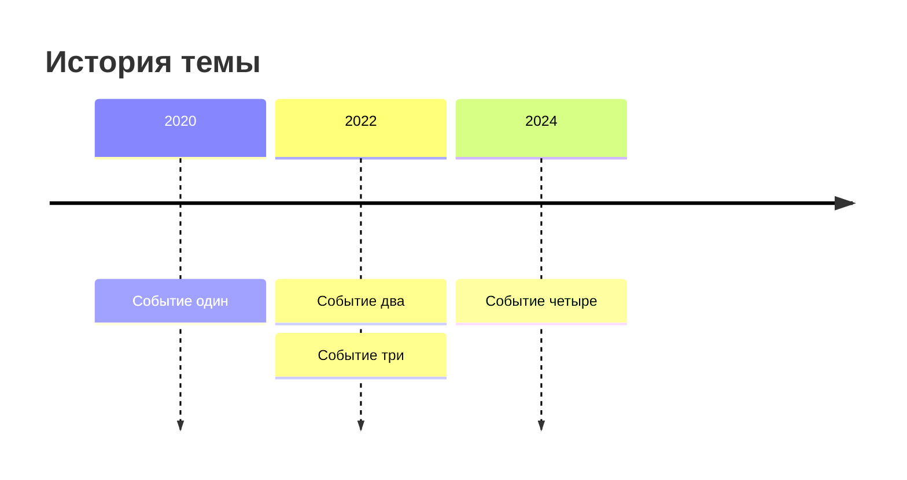
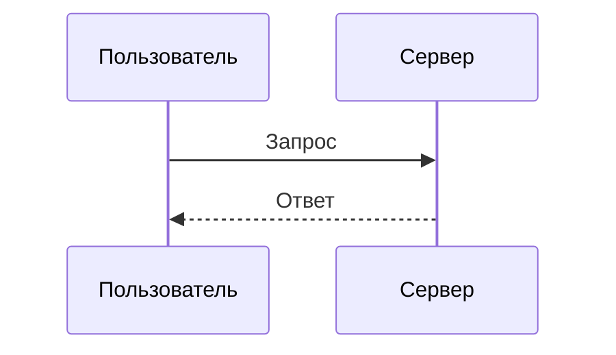
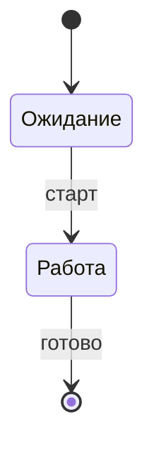

# Правила безопасного Mermaid

Частые причины, по которым диаграмма не рендерится, и как их избежать.

## Общие

- **Кавычки для текста с пробелами/кириллицей/спецсимволами:** `A["Узел с текстом"]`.
- Внутри меток избегай голых `()[]{};#"` — либо оборачивай всю метку в `"..."`.
- Одна диаграмма = один тип = один блок ` ```mermaid `.
- Первая строка блока — объявление типа (`flowchart TD`, `mindmap`, `timeline`…).
- Кавычки внутри метки экранируй как `&quot;` или замени на «ёлочки».

## flowchart



- Направление: `TD` (сверху вниз), `LR` (слева направо).
- Ромб-условие: `{...}`. Подпись на стрелке: `-->|"текст"|`.

## mindmap



- Отступы **только пробелами**, ровно и последовательно.
- Ровно один корень. Скобки у корня задают форму: `("...")`, `[...]`, `{{...}}`.

## timeline



## sequenceDiagram



## stateDiagram-v2



## Быстрая самопроверка

1. Тип диаграммы объявлен первой строкой?
2. Все метки с пробелами/кириллицей в кавычках?
3. Нет голых спецсимволов в метках?
4. В mindmap отступы пробелами и один корень?
5. Один тип на блок?
